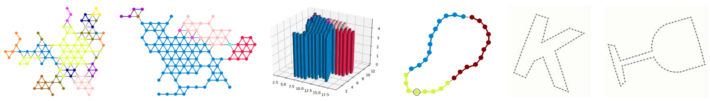

# swarm_formation_sim
A collection of swarm robot formation simulations using Python with Pygame and Matplotlib. I have done [swarm robot simulations with ROS](https://github.com/yangliu28/swarm_robot_ros_sim.git) before, but the combination of Python, Pygame and Matplotlib help verify the swarm algorithm quickly in a simplier setup, and model the swarm robots as dots to skip the collision problem.

Demo 1: [https://youtu.be/7AcXfG2bxoc]{https://youtu.be/7AcXfG2bxoc}

Demo 2: [https://youtu.be/TrTDzD4OjFI]{https://youtu.be/TrTDzD4OjFI}

## Contents
All the formation control algorithms simulated here agree on a few conditions of the robots. The robots can sensing relative position of neighbors with in sensing range. The robots can communicate with robots in communication range. Both sensing range and communication range are very small, most time they are treated the same in the simulations. (This corresponds to the physical infrared sensor that does sensing and communicating at same time.) The robot swarm is homogeneous. The robots can do omnidirectional movements. The robots are modelled as dots, so no collision avoidance method is studied here.

*line_formation_1.py* is the first line formation simulation featuring climbing method and competing mechanism. *line_formation_1_robot.py* containts the robot class for this simulation.

*line_formation_2.py* is similar to the first line formation, except implementing merging method instead of climbing to form the line. *line_formation_2_robot.py* containts the robot class for this simulation.

*loop_formation.py* uses same merging method to form a loop, the formation starts with a pair of robots, then a triangle formation as the initial loop. *loop_formation_robot.py* containts the robot class for this simulation.

*formation_functions.py* contains several frequeny used functions for the line and loop formations.

*loop_reshape_1_static.py* is the static version of the loop reshape simulation, focusing on the convergence of role assignment. Several tentative algorithms have been tested here. The finalized algorithms are actually in the dynamic version, so just skip this one.

*loop_reshape_2_dynamic.py* is the dynamic version of the loop reshape simulation. A new weighted averaging method is implemented to tolerate the conflict between distribution convergence and better distribution unipolarity. A new SMA-inspired motion strategy is used for the physical motion control of the loop reshape process.

*loop_reshape_reader.py* is a useful tool to read stored loop formation files (randomly generated from the reshape simulations), visualize them in pygame.

*loop_reshape_test_power.py* is for testing how power function can increase the unipolarity of a random distribution. Linear multiplier was later found to be more mild and thus a better choice. *loop_reshape_test_motion* is for testing the physical motion controlalgorithm of the loop reshape process, the SMA algorithm was first tested here. *curve_shape_test_filter.py* is for smoothing open curves or closed curves to the effect of human drawing like curves.

*trigridnet_probabilistic_consensus.py* is the test program for probabilistic consensus decision making algorithm, running on 2D equilateral triangle grid netwroks. *trigridnet_generator.py* is the corresponding 2D triangle grid network generator. *trigridnet_role_assignment.py* is the one-to-one role assignment simulation on the triangle grid, message relay is used for the consensus of assignment scheme.

*demo_1.py* is the first demo that combines previous simulations. The robots first aggregate together to form a random network. They run consensus decision making to choose the target loop shape, then the role assignment using message relay for target assignment. The robots disperse and aggregate again to form a loop with robots on their designated order. The loop then reshapes to the chosen shape.

*demo_2.py* is the second demo that combines previous simulations differently. The robots first aggregate to form a loop. They run consensus decision making to choose the target loop shape, then role assignment on the loop using an adapted consensus algorithm. At the same time of role assignment, the robots dynamically reshape to the chosen shape.

## Run the simulations
Install corresponding version of Pygame for your Python, optional dependencies include numpy, matplotlib, etc. See the header of the desired '.py' to find the necessary dependencies. Some simulation examples are listed below.

Line formation simulation with climbing method:

`python line_formation_1.py`

Line formation simulation with merging method:

`python line_formation_2.py`

Loop formation simulation:

`python loop_formation.py`

Loop reshape simulation:

`python loop_reshape_2_dynamic.py -i 30-5 -t 30-9 --nobargraph`

Probabilistic consensus algorithm simulation:

`python trigridnet_probabilistic_consensus.py -f 50-3 -d 30 --nobargraph`

Role assignment using message relay:

`python trigridnet_role_assignment.py -f 100-1`

Demo 1 (aggregation + decision making + role assignment + loop formation + loop reshaping):

`python demo_1.py -n 30`

Demo 2 (loop formation + (decision making + role assignment/loop reshape)):

`python demo_2.py -n 30`

## Publications

To be added.

## License
See the [LICENSE](LICENSE.md) file for license rights and limitations (MIT).

